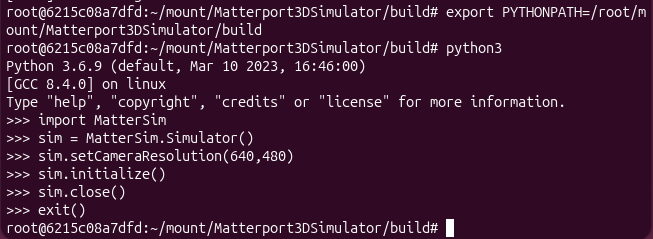

# Week 1 Checkpoint

## Student / Team

- Name(s): Ziyang HUANG
- Student ID(s): 20719974
- Date: 06/07/2026

## Environment

- [x] Python environment created
- [x] Dependencies installed without conflicts
- [x] Project folder structure understood

I used the Dockerfile provided by the project to configure the environment and dependencies.

## Smoke test

- [x] Smoke test command executed
- [x] No runtime crash
- [x] Output evidence attached

## Reflection

1. What was the hardest setup issue?
This project has been around for quite a long time, some parts have been deprecated, and some overseas resources cannot be accessed directly.
2. How did you solve it?
Find the updated resources online and refer to the project-related discussions. In some cases, domestic mirror sources have also been configured to solve the timeout issue.
3. What still needs support?
